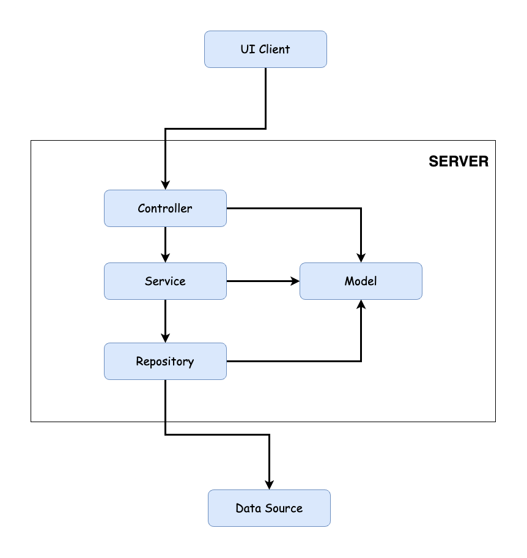
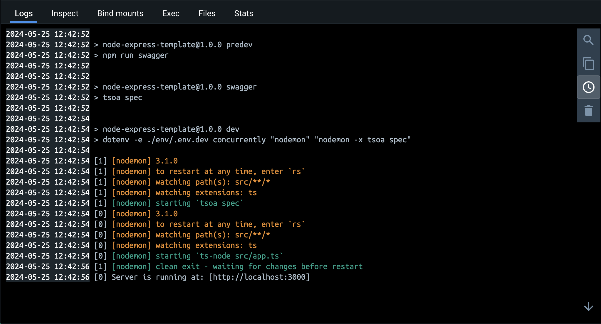
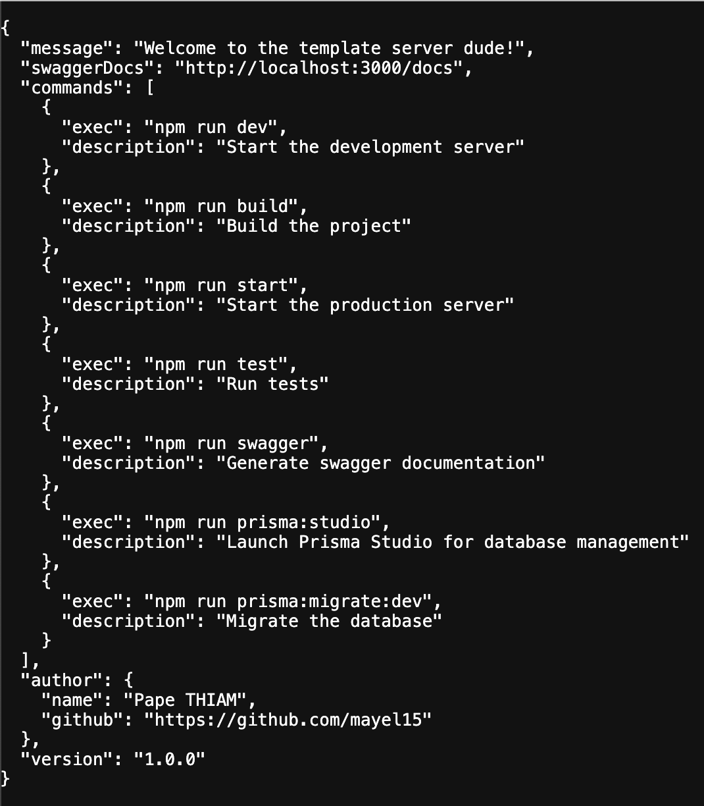

# 🩻 Node-Express Template

[](https://github.com/mayel15/node-express-template)

👨🏾‍💻 Pape THIAM [@mayel15](https://github.com/mayel15)

# 🧰 Stack

<a href="https://nodejs.org/docs/latest/api/" target="_blank" rel="noreferrer">  </a> <a href="https://expressjs.com/" target="_blank" rel="noreferrer">  </a> <a href="https://jestjs.io/fr/docs/getting-started" target="_blank" rel="noreferrer">  </a> <a href="https://www.prisma.io/docs" target="_blank" rel="noreferrer">  </a> <a href="https://www.typescriptlang.org/docs/" target="_blank" rel="noreferrer">  </a> <a href="https://www.postgresql.org" target="_blank" rel="noreferrer">  </a></a> <a href="https://www.docker.com/" target="_blank" rel="noreferrer">  </a>

## ➕ More

- Supertest
- Swagger

# 📄 Description of the projet

This is an opinionated boilerplate (template or skeleton, whatever you want) for Express and TypeScript. It uses Prisma as an ORM to easily switch databases with minimal code changes. This repository serves as a template to simplify the [creation of new repositories from it](https://docs.github.com/en/repositories/creating-and-managing-repositories/creating-a-repository-from-a-template).

## ⨠ Architecture



## 🗂️ `src` folder

```sh
├── controllers
├── enums
├── middlewares
├── models
├── repositories
├── routes
├── services
└── utils
```

# 🤖 Run and commands

- ⎒ Clone the project or create a repo git from this template

```sh
git clone https://github.com/mayel15/node-express-template
```

- 🚀 Run the server app with `Docker`

```sh
cd node-express-template
```

```sh
docker-compose up -d
```

- 🕙 Wait a moment

- ⚙️ The server will normally run at `http://localhost:3000/` and the route `/docs` is for `swagger`

- 🎞️ Overview of the runninng server

  - With `Docker Desktop`

    

  - With the `browser`

    

- 🧪 Run test

```sh
npm run test
```
